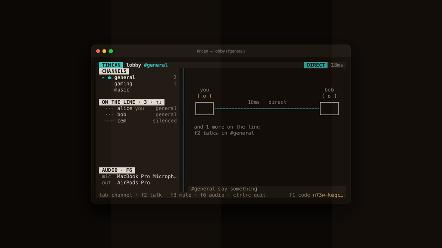

<p align="center">
  
</p>

<h1 align="center">tincan</h1>

<p align="center">
  <b>Serverless peer-to-peer voice and text chat for your terminal.</b>
</p>

<p align="center">
  <a href="https://github.com/bilalyazicioglu/tincan-cli/actions"></a>
  <a href="LICENSE"></a>
  <a href="docs/WIKI.md"></a>
  <a href="https://bilalyazicioglu.com/blog/tincan-serverless-voice-chat-in-terminal"></a>
  <a href="https://bilalyazicioglu.com/blog/tincan-terminalde-sesli-sohbet"></a>
</p>

<p align="center">
  <a href="#install">Install</a> ·
  <a href="#usage">Usage</a> ·
  <a href="#shortcuts">Shortcuts</a> ·
  <a href="#how-it-works">How it works</a> ·
  <a href="#security">Security</a> ·
  <a href="docs/wiki/9-Interface-Design.md">Design notes</a> ·
  <a href="https://bilalyazicioglu.com/blog/tincan-serverless-voice-chat-in-terminal">Blog (EN)</a> ·
  <a href="https://bilalyazicioglu.com/blog/tincan-terminalde-sesli-sohbet">Blog (TR)</a>
</p>

<p align="center">
  tincan does what Discord does, without needing anyone's server: the first person to open the app creates the room, sends the invite code it prints to their friends, and they connect with that code from anywhere in the world. No VPN, no port forwarding, no accounts.
</p>

<p align="center">
  
</p>

The palette is metal: a brown tin ground, brass for the string and the invite code,
and the two greens copper actually turns — bright patina for what is live, deeper
verdigris for a link that is holding.

The line down the middle is the connection. It runs taut when everyone is reached
directly, sags into a dashed line when someone is coming through a relay, and frays
when audio starts dropping. While anyone is talking a pulse travels down it, at the
speed of the round trip — so a slow link is something you see rather than read. The
meters beside each name move with that person's voice.

Before anyone has joined, the chat pane draws the same thing full size: your can, the
string, their can, with the latency written on it and your invite code underneath. It
stays up there while the conversation is short enough to leave the room for it, so a
full-screen terminal is never a wall of nothing.

Everything underneath that — the audio screen and its noise floor, turning one person
down without deafening the room, and the sounds the interface makes — is written up in
the [interface design notes](docs/wiki/9-Interface-Design.md), with the background story in the developer blog ([English](https://bilalyazicioglu.com/blog/tincan-serverless-voice-chat-in-terminal) / [Türkçe](https://bilalyazicioglu.com/blog/tincan-terminalde-sesli-sohbet)).

## Install

**Homebrew (macOS & Linux):**

```bash
brew tap bilalyazicioglu/tap && brew install tincan
```

**NPM:**

```bash
# Run directly without installing:
npx tincan-cli host

# Or install globally:
npm install -g tincan-cli
```

**Shell script (macOS & Linux):**

```bash
curl -fsSL https://raw.githubusercontent.com/bilalyazicioglu/tincan-cli/main/install.sh | sh
```

This downloads a prebuilt binary for your platform into `~/.local/bin` and verifies its
checksum. Anywhere without one it falls back to building from source. If you would rather
read the script before running it — always a reasonable instinct with `curl | sh` — it
lives at [`install.sh`](install.sh) in this repo.

**Windows:** use `npx tincan-cli host`, or download
`tincan-x86_64-pc-windows-msvc.zip` from the
[latest release](https://github.com/bilalyazicioglu/tincan-cli/releases/latest) and put
`tincan.exe` somewhere on your `PATH`. The shell script above is POSIX and will not
install it for you.

Prebuilt binaries are published for these five targets:

| Platform | Target |
| :--- | :--- |
| macOS, Apple Silicon | `aarch64-apple-darwin` |
| macOS, Intel | `x86_64-apple-darwin` |
| Linux, x86_64 | `x86_64-unknown-linux-gnu` |
| Linux, arm64 | `aarch64-unknown-linux-gnu` |
| Windows, x64 | `x86_64-pc-windows-msvc` |

A word on the last row: the Windows binary compiles and the test suite passes on
Windows in CI, which is not the same as the application having been used there. The
terminal UI, WASAPI device enumeration and the microphone permission prompt have not
been exercised on a real Windows machine. If you try it, [say how it
went](https://github.com/bilalyazicioglu/tincan-cli/issues).

**From source**, if you prefer it or your platform has no prebuilt binary:

```bash
cargo install --git https://github.com/bilalyazicioglu/tincan-cli
```

That needs Rust 1.91+ and a way to get Opus. The easiest is to install it from your
package manager — `cargo` picks it up through `pkg-config` and links it in:

```bash
brew install opus pkg-config                             # macOS
sudo apt install libopus-dev pkg-config libasound2-dev   # Debian/Ubuntu
```

Without a system Opus, the build compiles the vendored C source instead, which needs
autotools (`autoconf`, `automake`, `libtool`). Either way it takes a few minutes.

However you install it, you need a microphone and a speaker; any sample rate will do, since
tincan resamples to and from the 48 kHz Opus works at. On the first run your
operating system will ask for microphone permission — on macOS the prompt comes from the
terminal app running tincan (Terminal, iTerm, VS Code…), not from tincan itself.

## Usage

**Open a room:**

```bash
tincan host lobby --name alice
```

```
room:        lobby
passphrase:  chestnut-ferry-lens-moss
```

The room's address is derived from its name and passphrase, so that is all your friends
need — two things you can say down the phone or write on a whiteboard. The passphrase is
generated for you: it is what stops strangers from guessing their way into the room, so
bring your own with `-p` only if it is as strong (tincan warns when it is not).

**Open a room behind an invite code instead:**

```bash
tincan host --name alice --password secret
```

Without a room name tincan prints an invite code, puts it on your clipboard, and waits
for you to press Enter before taking over the screen. Send it to your friends — copy and
paste, 63 characters. The code is the host's public key, so this is the way in whose
security does not rest on the passphrase.

Once the interface is up the footer only has room for the first group of the code. Press
`F1` to print the whole thing into the chat pane and copy it again, so you can invite
someone without restarting the room.

**Join a room:**

```bash
tincan join lobby --name bob                            # asks for the passphrase
tincan join n73w-kuqc-uog2-... --name bob --password secret
```

`join` takes either a room name or an invite code. Joining by name without `-p` asks for
the passphrase, which keeps it out of the process list. Case, spaces, dashes and
underscores are forgiven in both room names and passphrases: `Chestnut Ferry Lens Moss`
works.

**See your audio devices:**

```bash
tincan devices
```

**Shell auto-completions:**

```bash
tincan completions zsh > ~/.zfunc/_tincan        # zsh
source <(tincan completions bash)               # bash
tincan completions fish > ~/.config/fish/completions/tincan.fish # fish
```

### Options

| Option             | Description                                                    |
| ------------------ | -------------------------------------------------------------- |
| `--name`, `-n`     | Your nickname in the room (default: your system username)      |
| `ROOM`             | `host`: room name (optional). `join`: room name or invite code |
| `--password`, `-p` | Passphrase. Generated for a named room when left out           |
| `--channels`       | Comma-separated channel list (default: `general,gaming,music`) |
| `--no-voice`       | Skip audio entirely; text chat only                            |
| `--input`          | Microphone to use (a distinctive part of the name is enough)   |
| `--output`         | Speaker to use                                                 |
| `--ptt`            | Push-to-talk: the microphone only opens with F4                |

### Shortcuts

| Key                        | Action                                        |
| -------------------------- | --------------------------------------------- |
| `Tab` / `Shift+Tab`        | Move between channels                         |
| `F2` (or `Ctrl+G`)         | Join / leave the voice of the channel you see |
| `F3` (or `Ctrl+T`)         | Mute / unmute your microphone                 |
| `F4`                       | Push-to-talk (only in `--ptt` mode)           |
| `F5`                       | Deafen: hear nobody (also closes your mic)    |
| `F6` (or `Ctrl+,`)         | Open audio settings                           |
| `n` (on that screen)       | Noise suppression on / off                    |
| `F1`                       | Show the full invite code (and copy it)       |
| `↑` / `↓`                  | Pick someone out of the roster                |
| `←` / `→`                  | Turn that person down or up                   |
| `Ctrl+K`                   | Silence selected person (or Vim scroll up)    |
| `Ctrl+J` / `Ctrl+K`        | Vim scroll down / up (also `Alt+J` / `Alt+K`) |
| `PageUp` / `PageDn`        | Scroll chat history up or down (15 lines)     |
| `Shift+↑` / `↓`            | Scroll chat history smoothly (also `Ctrl+↑/↓`)|
| Scroll wheel / Trackpad    | Scroll chat history smoothly (3 lines)        |
| `End`                      | Jump to latest message                        |
| `Esc`                      | Let go of the roster, or jump to latest chat  |
| `Enter`                    | Send the message                              |
| `Ctrl+C`                   | Quit                                          |

To pick a device, list them with `tincan devices` first, then pass part of a name:

```bash
tincan join <code> --input "MacBook Pro Mic" --output "AirPods"
```

The channel you are looking at and the channel you are connected to by voice are
independent: you can read the chat in "general" while talking in "gaming". In the channel
list, `>` marks the one you are viewing and `🔊` the one you are in.

The audio shortcuts are F-keys on purpose: in a terminal `Ctrl+M` (0x0D) and `Ctrl+J`
(0x0A) _are_ Enter and cannot be told apart from it — had those been used, the "mute" key
would have quietly sent a message.

The footer shows link status: how many peers you reach directly, how many flow through a
relay, the worst latency, and whether you have had audio dropouts. When everything is
fine it shows shortcut hints instead — technical detail only surfaces when there is a
problem.

### Environment

Set `NO_COLOR` for a colourless interface, `TINCAN_ASCII=1` if your terminal has no
box-drawing, `TINCAN_NO_MOTION=1` to hold the string still, and `TINCAN_THEME=light`
for the same palette on a light background.

## How it works

Two planes, kept apart:

**Control plane (star).** Whoever opens the room is the _coordinator_: the roster, the
channels and the chat flow through them. The traffic is tiny, a few hundred bytes per
second.

**Voice plane (mesh).** Peers in the same channel connect directly to each other and send
Opus packets as QUIC datagrams. **Voice never passes through the coordinator** — the
host's connection is not a bottleneck, and a six-person room needs about 160 kbps of
upload each.

```
        [alice: coordinator]
         /      |      \          ── control (reliable stream)
      bob     carol    dave
         \______|______/          ── voice (mesh, direct datagrams)
```

Connectivity comes from [iroh](https://iroh.computer): the invite code _is_ the peer's
public key. Most of the time a direct P2P connection is established; if hole punching
fails, traffic flows through a relay — which cannot decrypt anything, it only forwards.
QUIC encrypts every connection end to end and verifies the other side's identity by
public key.

### What tincan depends on

*Serverless* here means there is no tincan server: no account, no room registry, nothing
this project runs, and no copy of your conversation anywhere but on the machines having
it. It does not mean no infrastructure at all. tincan uses iroh's `N0` preset, which
brings in three services operated by [Number Zero](https://n0.computer), the company
behind iroh:

- **Finding each other.** Addresses are published to and looked up from n0's pkarr relay
  (`dns.iroh.link`) and its DNS. This is what makes a public key enough on its own —
  whether it arrived as an invite code or was derived from a room name and passphrase.
  Without it, neither resolves to anywhere you could connect to.
- **Getting through the router.** n0's relay servers — `use1-1`, `usw1-1`, `euc1-1` and
  `aps1-1` under `relay.n0.iroh.link` — are how two machines behind NATs learn each
  other's external addresses.
- **Carrying the traffic when that fails.** The same relays forward packets they have no
  key for, because the QUIC session is established between the two peers rather than with
  the relay.

So, put plainly: no server holds your room and no server can hear it, but two people
cannot currently find each other without n0's. If those services went away, new
connections would stop working. Pointing tincan at a relay and a DNS server you run
yourself is something iroh supports and tincan does not expose yet — that is
[issue #136](https://github.com/bilalyazicioglu/tincan-cli/issues/136).

### What the microphone sends

Before anything leaves the machine, the frame goes through
[RNNoise](https://jmvalin.ca/demo/rnnoise/) — a small recurrent network trained to tell
speech from everything else. It takes out what a noise gate cannot: a fan, an air
conditioner, the rain, the person typing while they talk. The gate decides *whether* you
are speaking; this decides what you sound like when you are.

It is on unless you turn it off, because a feature nobody finds is a feature nobody has.
The switch is `n` on the audio settings screen (`F6`), and the choice is remembered.

The cost is honest and worth stating: RNNoise is an overlap-add design, so it hands back
the frame *before* the one just given to it. That is **10 ms of added latency on the
capture path**, always, whether or not there is any noise to remove. Against tincan's
20 ms frames and three-frame jitter buffer it is a small share of the total, and it buys
a call where the other person can hear you over your own keyboard. Turn it off and the
10 ms goes away along with the suppression.

Only your own microphone is cleaned. Voices arriving from other people are played as they
were sent, so the work is one stream no matter how many people are in the room.

## Security

The password never travels over the wire. Both sides stretch it once with Argon2id into an
admission key; the coordinator sends a random nonce and the client returns a keyed
BLAKE2b MAC of it. Because the nonce is fresh on every connection, a captured proof cannot
be replayed, and the coordinator spends no Argon2 work on connection attempts.

The password is not for encryption but for **admission control** — QUIC already handles
the encryption.

What a relay can see is worth being exact about. It cannot read anything: the QUIC session
runs between the two peers and the relay holds no key to it. It does see the shape of the
traffic — which two public keys are talking, when, and how much — which is more than
nothing if that pattern is the part you were hoping to keep to yourself.

Your address is published, not only your key. For a public key to be enough to find you,
iroh announces the endpoint's reachable addresses — its IP addresses and its relay URL —
as a record signed under that key, and those records are public. Anyone holding the invite
code can resolve it to an address, and so can anyone who derives the same key from a room
name and passphrase. Peers then connect to each other directly whenever hole punching
works, so everyone in a room learns everyone else's IP address.

This is the part of the two-cans-and-a-string picture that is true in a way you might not
want: on a real string, the other end knows where you are. A service with servers in the
middle can stand between you and hide it. tincan has no such middle, and that cuts both
ways — nobody is keeping your conversation, and nobody is keeping your address out of it
either.

A room opened by name goes further: its coordinator key *is* `Argon2id(passphrase, room
name)`, so the passphrase is the room's address as well as its lock. That is what makes
the invite speakable, and it has costs, listed under [Known limits](#known-limits).

> `--password` is visible on the command line, so other users on the same machine can
> read it with `ps`. `tincan join <room>` without `-p` asks for the passphrase instead,
> and `tincan host <room>` without `-p` generates one.

## Development

```bash
cargo test              # 93 tests: unit + control plane + voice mesh
cargo clippy --all-targets
RUST_LOG=tincan=debug cargo run -- host 2>tincan.log   # logs to a file, so they don't scramble the UI
```

The tests never touch the internet: the control-plane and voice-mesh tests use two real
iroh endpoints over a real QUIC connection, but with relays and discovery disabled and
addresses introduced by hand. The audio tests use no audio hardware either — they attach
directly to the ends of the mesh.

### Source layout

```
src/
  proto.rs        On-the-wire types (control messages + voice packet header)
  room.rs         The room's authoritative state — the coordinator's single source
                  of truth, pure and tested
  auth.rs         Admission (Argon2id-stretched key, MAC over a nonce) and the
                  identity of a room opened by name
  passphrase.rs   Generated four-word passphrases, weak-password warning
  invite.rs       The invite code: base32, grouped, tolerant of pasting
  net/
    endpoint.rs   iroh endpoint setup, identity conversions
    control.rs    Coordinator server + joining client
    voice.rs      Voice mesh: connection management, datagram transport, channel filter
  audio/
    device.rs     cpal ↔ lock-free ring buffer bridge
    codec.rs      Opus encode/decode + loss concealment
    jitter.rs     Per-peer jitter buffer
    mixer.rs      Multi-source mixing + limiter
    vad.rs        Voice activity detection (indicator + DTX)
    denoise.rs    RNNoise noise suppression on the capture path
  ui/
    state.rs      Interface state (independent of network and terminal, tested)
    view.rs       Screen layout
examples/         Phase 0 probes — throwaway measurement tools
```

`examples/ping.rs` measures connectivity and latency between two machines;
`examples/loopback.rs` measures the audio chain. Both were written to validate design
decisions and are not used in the product.

## Known limits

- **The coordinator is a single point of failure.** If the host leaves, the room
  dissolves. Leader handover was deliberately left out of the MVP.
- **A device that reports no format cannot be opened.** Any sample rate works — capture
  and playback are resampled to and from Opus's 48 kHz with cubic interpolation, 16 kHz
  Bluetooth headsets included — but a device that will not say what format it runs at is
  refused rather than guessed at, and tincan says so and falls back to text chat.
- **Everyone in a room can see everyone's IP address**, and so can anyone who has the
  invite code, because addresses are published under the public key for the key to be
  enough to find you. Set out under [Security](#security). There is no middle to hide
  behind; that is the same property that keeps your conversation off anyone's server.
- **The coordinator keeps the last 200 lines of chat** and hands them to whoever joins
  next, so someone arriving late reads what was said before they got there. It is held in
  memory, never written to disk, and gone when the room closes.
- **Noise suppression costs 10 ms.** It is a fixed price on the capture path, paid
  whether or not there is any noise to remove, and it is the reason the switch exists.
  `n` on the settings screen gives the 10 ms back.
- **The invite code is 63 characters.** It cannot be shortened, because it is the public
  key itself — fine for copy and paste, not for reading down the phone. Open the room by
  name for an invite you can say out loud.
- **A room opened by name belongs to whoever knows the passphrase.** Its key no longer
  identifies a machine, which has three consequences:
  1. *Impersonation from inside.* Anyone with the passphrase can open a rival room under
     the same name and greet the people who join it.
  2. *Silent takeover.* Address records are signed by the room's key, so someone with the
     passphrase can publish their own addresses under it while the real host is running.
     The freshest record wins, and the host never notices.
  3. *Existence is guessable.* Anyone can compute the key for ("lobby", "123456") and look
     it up. Argon2id's cost is the only defence — which is why the passphrase is
     generated unless you bring your own.

  (1) and (2) are insider attacks, tolerable for a room of friends. If they are not for
  yours, open the room without a name and share the invite code.
- **A wrong room name or passphrase looks like a closed room.** It derives a different
  address, where nobody is listening, so tincan cannot tell you which of the two was
  wrong.
- **Scale is 2–6 people.** In a mesh everyone sends to everyone; past 8 you would need
  the coordinator to mix the audio (an SFU).
- **Push-to-talk is not hold-to-talk.** Terminals generally do not report key-release
  events, so in `--ptt` mode F4 works as a toggle: press once to open the microphone,
  press again to close it.
- **Finding each other depends on n0's public infrastructure.** Discovery and hole
  punching both go through servers run by Number Zero, set out under
  [What tincan depends on](#what-tincan-depends-on). This holds even for two machines on
  the same network: the preset tincan uses carries no local discovery, so a room does not
  form without an internet connection. None of it is configurable yet; #136 tracks that.
- **The first second of a connection flows through a relay** before switching to a direct
  link. You may notice the latency in the first moments after joining.

## Contributing

Bug reports and feature requests are welcome! Please use the
[issue templates](.github/ISSUE_TEMPLATE) when opening an issue, and review the
[pull request checklist](.github/PULL_REQUEST_TEMPLATE.md) before submitting a PR.

## License

MIT — see [LICENSE](LICENSE).
