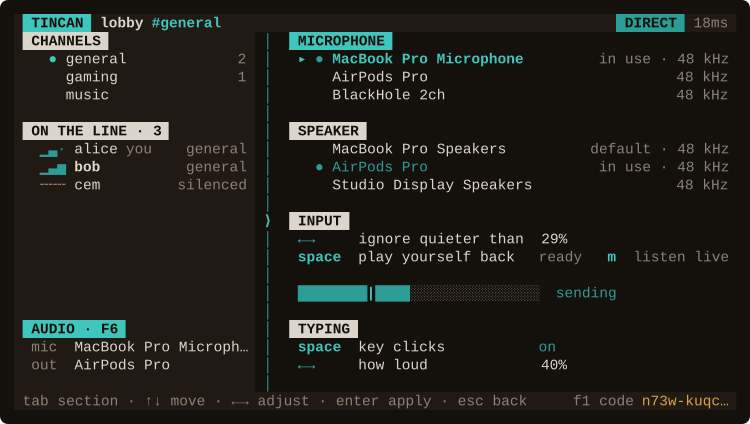

# Interface Design

Why the interface behaves the way it does. The README shows the room and explains the
string running down the middle of it; this is everything underneath that — the audio
screen, turning one person down, the sounds, and what gets remembered.

`F6` opens the audio screen: which microphone and speaker are in use, a way to hear
yourself, and the level meter with your noise floor marked on it. Anything
quieter than that mark never leaves your machine, which is how a fan or a noisy room
stays out of the call. `←`/`→` move the floor a step at a time, and `a` listens to the
room for a second and a half and sets it just above whatever it hears. It is remembered
per microphone, because a laptop microphone and a headset do not share a noise floor.

  

`F5` deafens you against the whole room, which is a blunt instrument. For one person
there are the arrow keys: `↑`/`↓` moves a cursor down the names under `ON THE LINE`,
`←`/`→` turns whoever it is on down or up, and `Ctrl+K` silences them outright. It is
the same cursor the channel list uses, in the same column, because it answers the same
question — this is the row your keys act on. Letters go to the message you are typing,
so none of this costs you a key you were using. (`Ctrl+K` and not `Ctrl+S`: in most
terminals `Ctrl+S` is XOFF and would freeze the session rather than quieten anybody.)

Until you have used it the section names its own key, the way the audio corner carries
`F6`; once the cursor is in the list the footer says more than a chip could, and the hint
gets out of the way.

Their meter keeps moving while they are turned down, and that is deliberate: someone you
have silenced should not look the same as someone who has gone quiet. It moves in the
grey a silent meter uses, though, so the movement reads as a voice that is not reaching
you whole — and that grey is what carries the setting once you move on, because the
exact number only appears while you are on that row changing it. The rest of the time
the column goes back to saying which channel the person is in, which is what it is for.
Silencing somebody is the exception, because it is one keystroke and it is total: their
meter is replaced by a mark that looks like neither a quiet one nor a loud one, the
column at the edge says `silenced`, and it makes the same two notes as closing your ears
on the whole room. Their name still goes bold when they speak, so you can always see
that you are cutting off somebody who is talking.

The setting is local — nobody is told you turned them down — and it lasts as long as the
session does, because identities are regenerated on every run and there is nothing stable
to remember them against.

A channel with something said in it since you last looked turns brass in the rail, so
the list tells you where to go without a count or a badge. Every message makes a sound
— one short note, the same whether you sent it or it arrived, deliberately the only
single note in a set of two-note gestures.

`space` records three seconds and plays them back. It records and plays in separate
stages rather than monitoring live, because on a laptop the microphone can hear the
speakers, and anything that opens both at once closes a loop between them that grows
until it clips. `m` gives you live monitoring anyway for when you are on headphones,
and cuts itself off if it starts feeding back.

Under `TYPING` the keyboard can be given a voice: a short burst of noise per key, off
until you ask for it and adjustable with `←`/`→`. Each key is seeded from the character
itself, so the same key always sounds the same and two keys never sound alike — a
keyboard rather than a random generator. The spacebar is lower and longer, and
backspace is duller.
